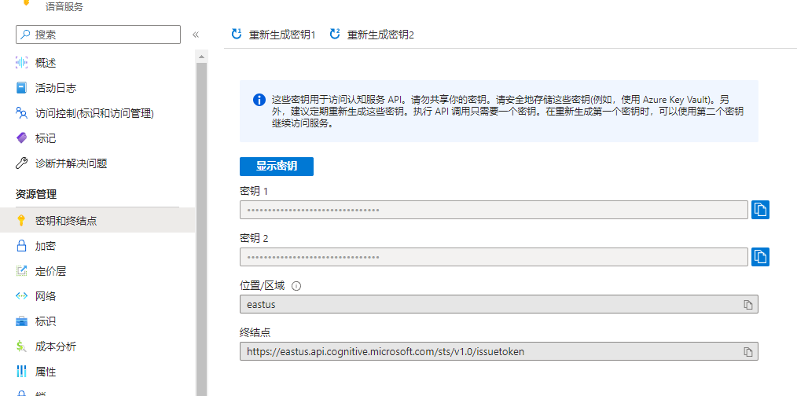

# 英文口语听力锻炼（支持飞书、钉钉、微信）

## 背景
由于openAI自动生成文本，想用它来提升英语口语能力。于是自己写了基于web的对话，但是这样要坐着输入输出，时间长就腰酸背痛。

想着能不能通过手机躺着练习口语，~~于是调研了微信、钉钉开发者文档，发现微信不支持；钉钉需要在小程序开发录音功能，比较麻烦。~~**（后发现可以实现，等排期实现）**

后面发现飞书支持**获取录音、录音下载**开发者功能，于是才有了这个项目。

## 客户端

支持微信、钉钉、飞书实现英语锻炼

- [飞书说明文档](feishu.md) 目前完成是飞书
- [微信说明文档](weixin.md) 待开发
- [钉钉说明文档](dingding.md)  待开发

功能对标

|                      | 飞书 | 微信               | 钉钉           |
| -------------------- | ---- | ------------------ | -------------- |
| 回复消息，建立上下文 | 支持 | 没有上下文标记     | 没有上下文标记 |
| 表情回调事件         | 支持 | 不支持（没有表情） | 不支持         |


## 安装配置

### 创建openai的key

访问：https://platform.openai.com/account/api-keys

点击`create new secret key`，就可以获取到key。


### 腾讯key

> https://cloud.tencent.com/document/product/1093/35686#.E5.85.8D.E8.B4.B9.E9.A2.9D.E5.BA.A6

> 腾讯语音识别文字功能每月有免费额度（每月5000次）

访问[腾讯ASR网站](https://console.cloud.tencent.com/asr)，开通ASR功能（主要是一句话识别）。

接着访问[API密钥管理](https://console.cloud.tencent.com/cam/capi)，创建一个密钥。


### google key

访问[Google语音服务](https://console.cloud.google.com/speech/text-to-speech)

> Text-to-Speech 的价格取决于**每月**发送给服务并合成为音频的字符数量。您必须启用结算功能才能使用 Text-to-Speech，并且如果您的用量超过了每月允许的免费字符数上限，系统会自动向您收费。
>
> | 特征                                                         | 每月免费用量      | 达到免费用量限制后的价格          |
> | :----------------------------------------------------------- | :---------------- | :-------------------------------- |
> | 标准（非 WaveNet、非 Neural2）语音                           | 0 至 400 万个字符 | $0.000004/字符（$4.00/百万字符）  |
> | [WaveNet](https://cloud.google.com/text-to-speech/docs/wavenet?hl=zh-cn) 语音 | 0 至 100 万个字符 | $0.000016/字符（$16.00/百万字符） |
> | [Neural2](https://cloud.google.com/text-to-speech/docs/wavenet?hl=zh-cn#neural2_voices) 语音 | 0 至 100 万个字符 | $0.000016/字符（$16.00/百万字符） |


### 微软key

> 需要信用卡，新注册信用卡可以免费使用微软语音服务。

> **如果没有这个，建议使用sougou或者youdao语音的引擎。**

访问[微软语音服务](https://portal.azure.com/#view/Microsoft_Azure_ProjectOxford/CognitiveServicesHub/~/SpeechServices)，创建订阅。

在**密钥和终结点**中获取密钥1和地区




### 配置文件

修改`core\config.py`文件，填上对应的密钥。

```
APP_ID = "" #飞书应用的App ID
APP_SECRET = "" # 飞书应用的App Secret
ENCRYPT_KEY = "" #飞书应用事件订阅的Encrypt Key
VERIFICATION_TOKEN = "" #飞书应用事件订阅的Verification Token
LARK_HOST = "https://open.feishu.cn"
TencentSecretId = "" #腾讯SecretId，用来语音转文字
TencentSecretKey = "" #腾讯SecretKey，用来语音转文字
AiKey = "sk-" #openai的key

azure_speech_key = ""  #微软的key
azure_service_region = "eastus" #微软资源的地区

text_and_audio = 0 #默认只回复英文语音，设置为1同时回复英语语音和英语文本。当配置为0的时候，可以采用官方的语音翻译功能对回复录音进行翻译，用于练听力。
random_word_num = 10 #随机抽取单词的个数
syntactic_correction = 0 #英语语法修正，默认不开启。修改为1代表开启语法批改。

audio_mode = "youdao"  #有三种语音模式，分别是：`youdao`、`sougou`、`azure`
sougou_speaker = 6 #搜狗语音有6种语音，可以选择自己喜欢的，参考https://fanyi.sogou.com/reventondc/synthesis?text=hello%20i%20am%20xiaoming&speaker=6
azure_speaker = "en-US-AriaNeural" #点击语音库，选择自己喜欢的声音。https://speech.microsoft.com/portal


```

> 可以不配置腾讯的key，**用飞书官方自带的语音转文字功能**。


### 本地部署

```bash
apt install -y ffmpeg
cd /opt 
git clone https://github.com/yingshang/lanuage-talk-listen
cd feishu-talk && pip3 install -r requirements.txt
python3 app.py
```

### docker部署
```bash
cd /opt 
git clone https://github.com/yingshang/lanuage-talk-listen
cd lanuage-talk-listen
docker build -t lanuage-talk-listen .
docker run -itd -p 443:443 -v /opt/file:/opt/lanuage-talk-listen/file --restart=always lanuage-talk-listen
```


## todo

- [x] 语法批改

- [x] Azure SSML创建自定义音频

- [x] 话题模式


- [x] 余额查询
- [x] 帮助列表
- [x] 查询模式
- [x] 使用官方的语音识别（就可以不用同时发送语音和文字）
- [x] 词汇题生成


- [x] AI原文

- [x] 录入单词

- [x] 要背的单词随机抽取生成阅读文章（**需要上面录入单词**）

- [x] 英文句子播放

- [x] 表情替代文字功能

- [x] 单词分析（词根词缀助记）

- [x] 角色扮演

- [x] 听力场景生成

- [X] 听力阅读输出问题和选项

- [x] 口语评分（azure口语评测、腾讯智聆评测）

- [ ] 单词听力模式（返回音频，输入英文单词）

- [ ] 拼写模式（返回中文，输入英文）

- [ ] 添加语种(粤语、德语、法语等)

- [ ] 添加企业微信功能

  > https://developer.work.weixin.qq.com/document/path/90250

- [ ] 添加钉钉功能

  > https://open.dingtalk.com/document/orgapp/download-the-file-content-of-the-robot-receiving-message
  >
  > https://open.dingtalk.com/document/orgapp/the-application-robot-in-the-enterprise-sends-a-single-chat

- [X] excel文档导入和模板下载（用于托福独立口语题目导入）
- [ ] 托福独立口语（任务1随机出题、任务1评分、任务2随机出题、任务2评分、任务3随机出题、任务3评分、任务4随机出题、任务4评分）


## 更新日志

- 2023.4.14：完成基本框架编写
- 2023.4.18：完成帮助列表、余额查询、清除会话状态、使用官方的语音识别、中文交流、英文句子播放、录入单词、词汇生成阅读、Azure SSML创建自定义音频
- 2023.4.20：修复azure语音转换不了文字。新增英语对话功能、语法批改、AI原文、听力场景生成功能。优化代码。
- 2023.4.21：新增表情替代文字功能
- 2023.4.24：新增听力阅读输出问题和选项功能
- 2023.4.27：删除一些没用功能。重写上下文对话逻辑。添加sqlite保存数据功能、添加更多表情场景（英语播放、语法批改、口语评测）。
- 2023.5.4：调研钉钉和微信开发者文档（确定其支持功能）。重构目录，把飞书代码移到对应目录。编写对应的文档。
- 2023.5.5：新增文件回复功能（将音频文件变成文件类型，将音频文件打开后台播放，用于学校和讲座场景）。更新下托福听力场景。
- 2023.5.9：完善帮助列表。新增托福口语TASK1场景、指定听力场景生成和听力场景总览功能。
- 2023.5.11：新增托福口语TASK1任务答案生成功能和优化评分prompt。

## 联系方式


